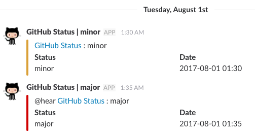

# github-status

* Notify a GitHub Site Status to Slack incoming webhook.
* Get status (json) from https://status.github.com/api/ then post a messge to Slack incoming webhook.

## Setup
* Create a config file `config.json` similar to `config.json.sample`.

## Build

```
$ make
```

If you want to run on the linux.

```
$ make linux
```

## Example


